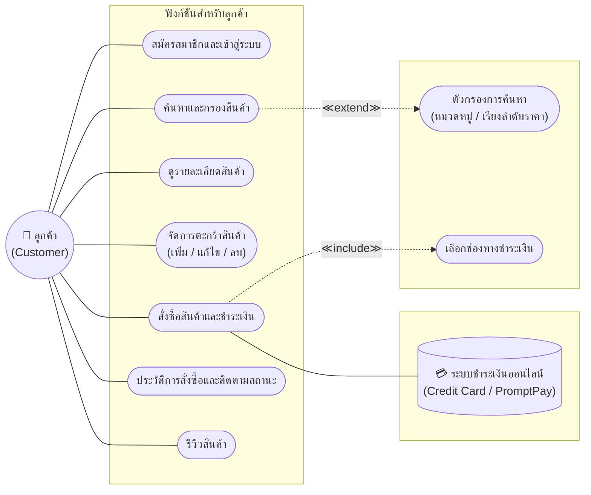
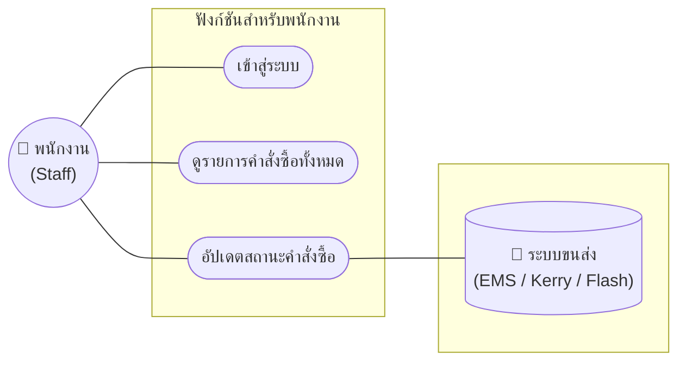
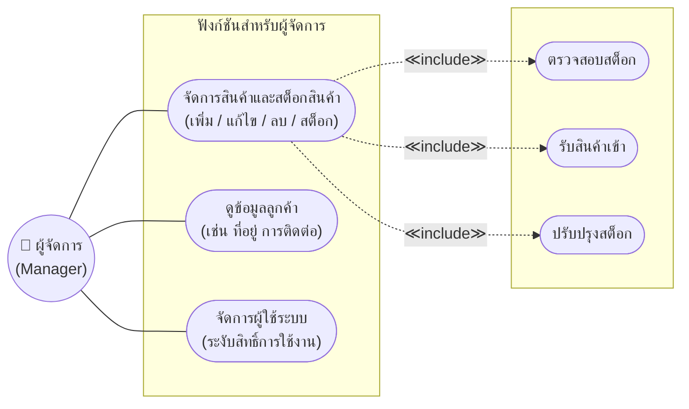
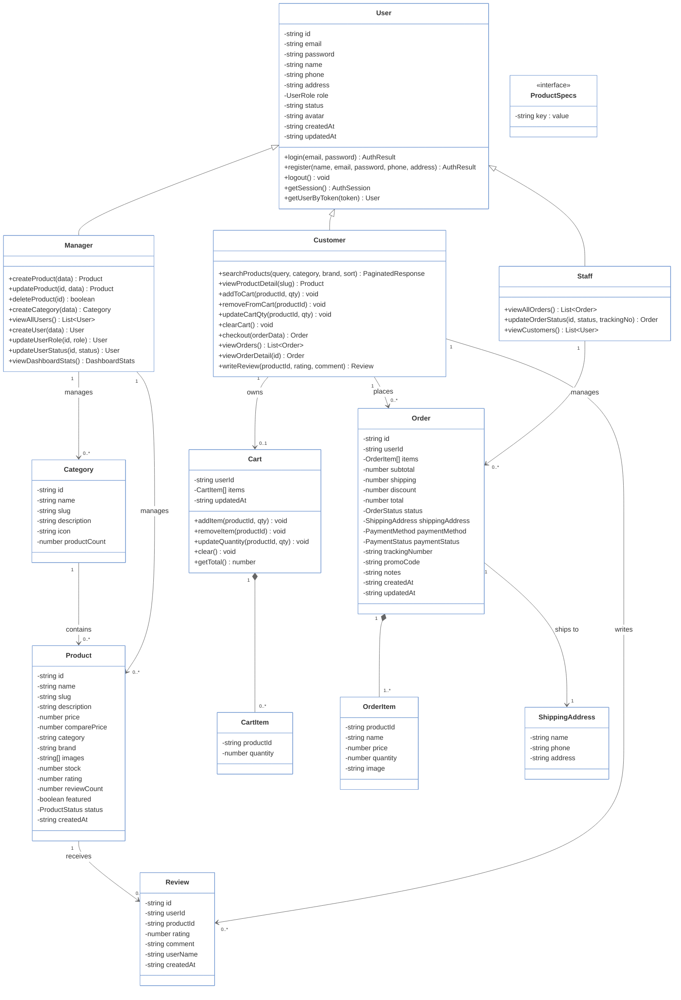
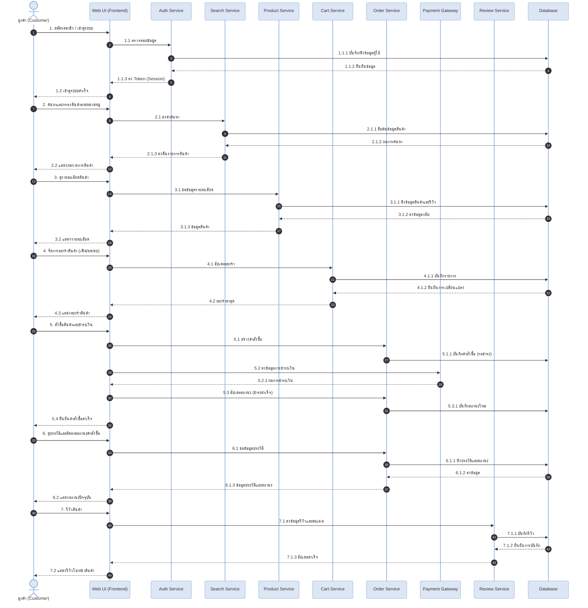
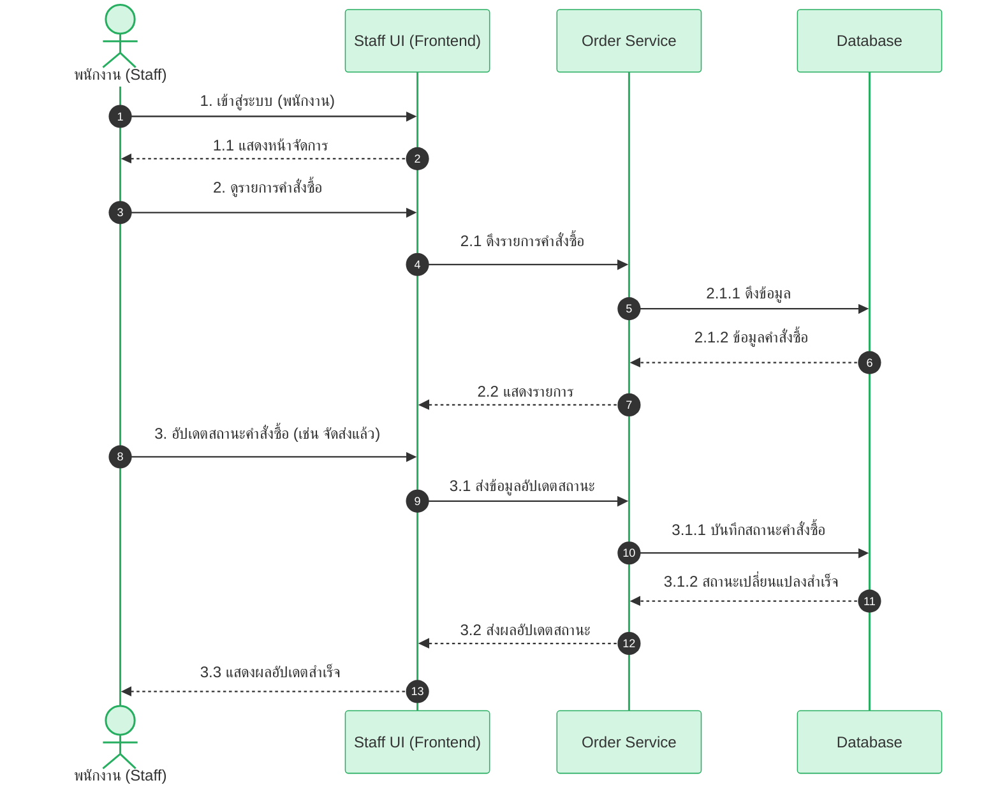
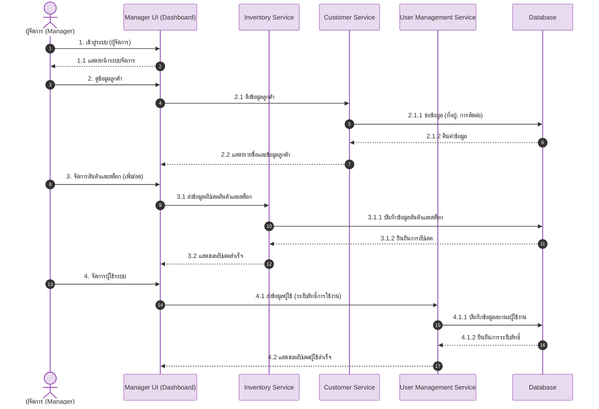
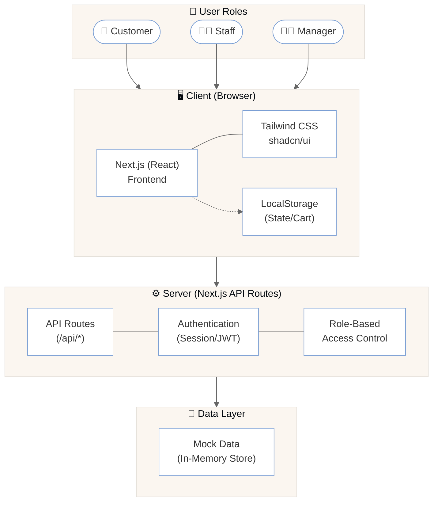

# 🖥️ PC Center – ศูนย์รวมคอมพิวเตอร์และอุปกรณ์ไอที

## 📌 CSI204 Project Hub
ระบบเว็บไซต์ขายคอมพิวเตอร์และอุปกรณ์ไอทีออนไลน์ (E-Commerce Platform)

---

## 📚 สารบัญ (Table of Contents)

1. [ข้อเสนอโครงงาน (Project Proposal)](#1-ข้อเสนอโครงงาน-project-proposal)
2. [Persona Design](#2-persona-design)
3. [การประยุกต์ใช้เครื่องมือในกระบวนการ SDLC](#3-การประยุกต์ใช้เครื่องมือในกระบวนการ-sdlc)
4. [Use Case Diagram](#4-use-case-diagram)
5. [Class Diagram](#5-class-diagram)
6. [แผนภาพลำดับการทำงาน (Sequence Diagram)](#6-แผนภาพลำดับการทำงาน-sequence-diagram)
7. [Wireframe และ Prototype](#7-wireframe-และ-prototype)
8. [System Architecture](#8-system-architecture)
9. [Tools & Technologies](#9-tools--technologies)
10. [Data Schema (JSON)](#10-data-schema-json)

---

## 1. ข้อเสนอโครงงาน (Project Proposal)

* **ชื่อกลุ่ม:** PC Center
* **ชื่อโครงงาน (ภาษาไทย):** PC Center – ศูนย์รวมคอมพิวเตอร์และอุปกรณ์ไอที
* **ชื่อโครงงาน (ภาษาอังกฤษ):** PC Center – Online PC & IT Equipment Store

### 📝 ความเป็นมาและความสำคัญ (Background & Significance)
ปัจจุบันคอมพิวเตอร์และอุปกรณ์ไอทีมีความสำคัญอย่างมาก แต่ร้านค้าหลายแห่งยังขาดช่องทางออนไลน์ที่ช่วยให้ลูกค้าค้นหาและสั่งซื้อได้อย่างสะดวกรวดเร็ว โครงงานนี้จึงพัฒนาเว็บไซต์จำหน่ายอุปกรณ์ไอทีแบบครบวงจร ที่มีหน้าร้านทันสมัย ใช้งานง่าย เพื่อให้ลูกค้าเลือกซื้อสินค้าได้ตลอด 24 ชั่วโมง พร้อมทั้งพัฒนาระบบจัดการหลังบ้าน (Dashboard) ที่มีการแบ่งระดับสิทธิ์ผู้ใช้งานอย่างเป็นระบบ ซึ่งจะช่วยให้ร้านค้าสามารถบริหารจัดการสต็อกสินค้าและคำสั่งซื้อได้อย่างมีประสิทธิภาพ

### 👥 สมาชิกในกลุ่ม (Group Members)

| ลำดับ | รหัสนักศึกษา | ชื่อ-สกุล | หน้าที่รับผิดชอบ |
| :---: | :---: | :--- | :--- |
| 1 | 67090746 | นายธนากร ธิติพุทธปราสาท | Project Manager |
| 2 | 66097958 |นายยศพล เปี่ยมบางแวก | full stack dev |
| 3 | 66097807 | นายเป็นไท ศรีไชยมูล | full stack dev |

### 🎯 วัตถุประสงค์ (Objectives)
1. เพื่อออกแบบและพัฒนาเว็บไซต์อีคอมเมิร์ซสำหรับจำหน่ายอุปกรณ์คอมพิวเตอร์ ที่มีดีไซน์ทันสมัย ใช้งานง่าย
2. เพื่อพัฒนาระบบหน้าร้าน (Storefront) ที่ช่วยอำนวยความสะดวกให้ลูกค้าสามารถค้นหา กรองหมวดหมู่สินค้า จัดการตะกร้า และทำรายการสั่งซื้อได้อย่างรวดเร็ว
3. เพื่อพัฒนาระบบจัดการหลังบ้าน (Dashboard) ที่มีการแบ่งระดับสิทธิ์การเข้าถึง (Role-based Access Control) เพื่อให้ทีมงานสามารถบริหารจัดการสินค้า คำสั่งซื้อ และข้อมูลผู้ใช้ได้อย่างมีประสิทธิภาพ

### 🔍 ขอบเขตของโครงงาน (Project Scope)
* **Customer (ลูกค้า):**
  - ระบบสมัครสมาชิกและเข้าสู่ระบบ
  - ระบบค้นหาและกรองสินค้าตามหมวดหมู่
  - ระบบดูรายละเอียดสินค้า
  - ระบบจัดการตะกร้าสินค้า
  - ระบบสั่งซื้อสินค้าและชำระเงิน
  - ประวัติการสั่งซื้อ
  - ระบบติดตามสถานะคำสั่งซื้อ
  - ระบบรีวิวสินค้า
* **Staff (พนักงาน):**
  - ระบบเข้าสู่ระบบ
  - ระบบดูรายการคำสั่งซื้อทั้งหมด
  - ระบบอัปเดตสถานะคำสั่งซื้อ
* **Manager (ผู้จัดการ):**
  - ระบบจัดการสินค้าและสต็อกสินค้า
  - ระบบดูข้อมูลลูกค้า (เช่น ที่อยู่ การติดต่อ)
  - ระบบจัดการผู้ใช้ระบบ (ระงับสิทธิ์การใช้งาน)

### 📊 ความเป็นไปได้ของโครงงาน (Project Feasibility)
* **ด้านเทคนิค:** ใช้เทคโนโลยี Next.js ที่ผู้พัฒนาคุ้นเคยและมีแหล่งข้อมูลสนับสนุนครบถ้วน
* **ด้านงบประมาณ:** ใช้เครื่องมือฟรีทั้งหมด
* **ด้านเวลา:** สามารถพัฒนาให้เสร็จภายในระยะเวลาของรายวิชา

---

## 2. Persona Design

### 👤 Persona 1: Customer (ลูกค้า)
Name: ลูกค้าทั่วไป / นักศึกษา / ผู้ใช้งานทั่วไป
Age: 18 - 35
Occupation: Student / Freelancer / Office Worker

Goals:
- ค้นหาและเปรียบเทียบสินค้าคอมพิวเตอร์ (CPU, GPU, RAM, SSD และอุปกรณ์ต่อพ่วงอื่น ๆ) ได้สะดวก
- สั่งซื้อสินค้าออนไลน์ เลือกวิธีชำระเงิน และกรอกที่อยู่จัดส่งได้ครบจบในขั้นตอนเดียว
- ติดตามสถานะคำสั่งซื้อและดูประวัติการสั่งซื้อของตนเอง
- เขียนรีวิวสินค้า

Pain Points:
- เดินทางไปร้านค้าไม่สะดวก ต้องการสั่งซื้อออนไลน์ตลอด 24 ชั่วโมง
- ข้อมูลสินค้าในเว็บทั่วไปไม่ครบถ้วน ต้องเปิดหลายแหล่งเปรียบเทียบ
- ไม่สามารถตรวจสอบสถานะคำสั่งซื้อและเลขพัสดุได้ง่าย

Needs:
- ค้นหาสินค้าด้วยคีย์เวิร์ด กรองตามหมวดหมู่ และเรียงลำดับราคา
- มีรายละเอียดสินค้าครบถ้วน พร้อมรูปภาพประกอบ
- จัดการตะกร้าสินค้า (เพิ่ม / ลบ / แก้ไขจำนวน) และดำเนินการสั่งซื้อพร้อมเลือกช่องทางชำระเงิน
- ดูประวัติคำสั่งซื้อ ติดตามสถานะ และเลขพัสดุได้ด้วยตัวเอง

### 🧑‍💼 Persona 2: Staff (พนักงาน)
Name: พนักงานดูแลคำสั่งซื้อ
Age: 22 - 40
Occupation: Sales Staff / Order Fulfillment Staff

Goals:
- ตรวจสอบรายการคำสั่งซื้อทั้งหมดในระบบ
- อัปเดตสถานะคำสั่งซื้อ (รอดำเนินการ → กำลังจัดส่ง → จัดส่งแล้ว) ได้อย่างรวดเร็ว
- ดูข้อมูลลูกค้าเพื่อประกอบการจัดส่ง

Pain Points:
- การติดตามคำสั่งซื้อจำนวนมากแบบ manual ทำได้ยากและเสียเวลา
- ไม่มีระบบรวมข้อมูลการสั่งซื้อให้ดูภาพรวมได้ทันที

Needs:
- หน้าแสดงภาพรวมของคำสั่งซื้อและจำนวนสินค้า
- ระบบจัดการคำสั่งซื้อที่ค้นหา กรอง และอัปเดตสถานะได้ง่าย
- สามารถดูข้อมูลลูกค้า (ชื่อ ที่อยู่ เบอร์โทร) ประกอบการจัดส่งได้

### 👨‍💼 Persona 3: Manager (ผู้จัดการ)
Name: ผู้จัดการร้าน / เจ้าของกิจการ
Age: 30 - 50
Occupation: Store Manager / Business Owner

Goals:
- จัดการข้อมูลสินค้า (เพิ่ม / แก้ไข / ลบ) และบริหารสต็อกสินค้า
- บริหารจัดการผู้ใช้ระบบ (เพิ่มผู้ใช้ / เปิด-ปิดสถานะบัญชี)
- ตรวจสอบภาพรวมยอดขายและรายงานสรุปของระบบ

Pain Points:
- การจัดการสินค้าจำนวนมากต้องมีระบบที่รองรับการค้นหาและแก้ไขข้อมูลได้รวดเร็ว
- ต้องการควบคุมสิทธิ์การเข้าถึงของผู้ใช้งาน
- ต้องดูสรุปยอดขาย สถานะคำสั่งซื้อ และสินค้า Low Stock ได้ในที่เดียว

Needs:
- Dashboard แสดงสถิติรวม (ยอดขาย, จำนวนคำสั่งซื้อ, สินค้า Low Stock, จำนวนลูกค้า)
- ระบบจัดการสินค้าแบบ CRUD พร้อมจัดการสต็อกและหมวดหมู่
- ระบบจัดการผู้ใช้ (เปิด-ปิดสถานะ, เพิ่มผู้ใช้ใหม่)

---

## 3. การประยุกต์ใช้เครื่องมือในกระบวนการ SDLC

ทีมของเราเลือกใช้เครื่องมือต่างๆ ในแต่ละขั้นตอนของการพัฒนาโปรเจกต์ (SDLC) ดังนี้:

### 3.1 Planning (การวางแผน)
* **เครื่องมือที่ใช้:** GitHub Projects, Discord
* **เหตุผล:** เราต้องการระบบที่ช่วยแบ่งงานให้คนในทีมและอัปเดตงานได้ง่ายๆ รวมถึงมีช่องทางไว้แชทคุยและประชุมงานกัน
* **การนำไปใช้งาน:** เราใช้ GitHub Projects เพื่อลิสต์ว่าใครต้องทำอะไรบ้าง และงานถึงไหนแล้ว ส่วน Discord เอาไว้พูดคุยและอัปเดตความคืบหน้าของทีม

### 3.2 Analysis & Design (การวิเคราะห์และออกแบบ)
* **เครื่องมือที่ใช้:** Figma, Mermaid.js
* **เหตุผล:** Figma ใช้งานง่ายและเหมาะกับการออกแบบหน้าจอเว็บ ส่วน Mermaid.js ช่วยให้เราเขียนแผนภาพระบบผ่านการเขียนโค้ดง่ายๆ (Markdown)
* **การนำไปใช้งาน:** เราใช้ Mermaid.js วาดแผนภาพการทำงานของระบบ (เช่น Use Case, Class, Sequence Diagram) และใช้ Figma ออกแบบโครงร่างเว็บ (Wireframe) รวมถึงทำตัวต้นแบบเว็บที่กดโต้ตอบได้จริง (Prototype)

### 3.3 Development (การพัฒนา)
* **เครื่องมือที่ใช้:** VS Code, Git/GitHub, Next.js, Tailwind CSS
* **เหตุผล:** เป็นกลุ่มเครื่องมือยอดฮิตที่ช่วยให้เราสร้างเว็บได้เร็วขึ้น และสามารถแชร์โค้ดทำงานร่วมกันหลายคนได้อย่างเป็นระบบ
* **การนำไปใช้งาน:** ทีมใช้ VS Code เพื่อเขียนโค้ดตัวเว็บด้วยเฟรมเวิร์ก Next.js แล้วตกแต่งความสวยงามด้วย Tailwind CSS จากนั้นจะส่งโค้ดทั้งหมดไปรวมและเก็บรักษาไว้บน GitHub

### 3.4 Testing (การทดสอบ)
* **เครื่องมือที่ใช้:** Chrome DevTools, Postman
* **เหตุผล:** เป็นเครื่องมือพื้นฐานในการใช้ตรวจเช็กความเรียบร้อยของหน้าเว็บ และเช็กการทำงานของระบบหลังบ้าน (API)
* **การนำไปใช้งาน:** เราใช้ Chrome DevTools เพื่อทดสอบว่าหน้าเว็บแสดงผลบนมือถือได้พอดีไหม และเช็กระบบตะกร้าสินค้าในเบราว์เซอร์ ส่วน Postman เราใช้จำลองการส่งข้อมูลไปที่ระบบหลังบ้านเพื่อดูว่าตอบกลับมาถูกต้องหรือไม่

### 3.5 Deployment (การนำเว็บขึ้นออนไลน์)
* **เครื่องมือที่ใช้:** Vercel
* **เหตุผล:** ใช้งานฟรี สะดวก และทำงานเข้ากับ Next.js ได้อย่างไร้รอยต่อ
* **การนำไปใช้งาน:** เราเชื่อมต่อ Vercel เข้ากับ GitHub ของโปรเจกต์ เมื่อมีคนในทีมอัปเดตโค้ดเวอร์ชันใหม่ลงในระบบ Vercel จะทำการประมวลผลและอัปเดตเว็บไซต์ออนไลน์ให้ใหม่โดยอัตโนมัติ

---

## 4. Use Case Diagram



### 4.2 ฟังก์ชันสำหรับพนักงาน (Staff)



### 4.3 ฟังก์ชันสำหรับผู้จัดการ (Manager)



---

## 5. Class Diagram



---

## 6. แผนภาพลำดับการทำงาน (Sequence Diagram)

### 6.1 กระบวนการของลูกค้า : ลูกค้า (Customer Journey)



### 6.2 กระบวนการของพนักงาน : จัดการออเดอร์



### 6.3 กระบวนการของผู้จัดการ : จัดการข้อมูลลูกค้า สินค้า และผู้ใช้ระบบ



---

## 7. Wireframe และ Prototype

**Figma Design & Prototype:** [PC-Center Figma](https://www.figma.com/design/IYlNf0A4R423lRC0onIuXK/PC-Center?node-id=0-1&t=K7EjI2luahWOsCBa-1)


---

## 8. System Architecture



---

## 9. Tools & Technologies

* **Frontend Framework:** Next.js (React), TypeScript
* **Styling & UI:** Tailwind CSS, shadcn/ui, Lucide React
* **Design:** Figma
* **Version Control:** Git, GitHub
* **Storage / Data:** LocalStorage (Browser) / In-Memory Mock Data (Server-side)

---

## 10. Data Schema (JSON)

**👤 User**
```json
{
  "id": "usr_001",
  "email": "admin@pccenter.com",
  "password": "hash_39c43b7d",
  "name": "Admin Manager",
  "phone": "0891234567",
  "address": "99 ถ.รัชดาภิเษก แขวงดินแดง เขตดินแดง กรุงเทพฯ 10400",
  "role": "manager",
  "status": "active",
  "avatar": "/avatars/manager.png",
  "createdAt": "2025-01-01T00:00:00Z",
  "updatedAt": "2025-01-01T00:00:00Z"
}
```
> **UserRole:** `"customer"` | `"staff"` | `"manager"` · **Status:** `"active"` | `"inactive"`

---

**📂 Category**
```json
{
  "id": "cat_001",
  "name": "โปรเซสเซอร์ (CPU)",
  "slug": "cpu",
  "description": "หน่วยประมวลผลกลาง",
  "icon": "Cpu",
  "productCount": 4
}
```

---

**📦 Product**
```json
{
  "id": "prod_001",
  "name": "AMD Ryzen 9 9950X",
  "slug": "amd-ryzen-9-9950x",
  "description": "โปรเซสเซอร์ AMD Ryzen 9 9950X 16 Cores 32 Threads ...",
  "price": 25900,
  "comparePrice": 28900,
  "category": "cpu",
  "brand": "AMD",
  "images": ["/images/CPU/AMDRyzen9_9950X.jpg"],
  "specs": {
    "cores": "16 Cores / 32 Threads",
    "base_clock": "4.3 GHz",
    "boost_clock": "5.7 GHz",
    "cache": "80MB",
    "tdp": "170W",
    "socket": "AM5"
  },
  "stock": 12,
  "rating": 4.9,
  "reviewCount": 89,
  "featured": true,
  "status": "active",
  "createdAt": "2025-01-10T00:00:00Z"
}
```
> **ProductStatus:** `"active"` | `"low_stock"` | `"out_of_stock"`

---

**🛒 Cart**
```json
{
  "userId": "usr_003",
  "items": [
    {
      "productId": "prod_001",
      "quantity": 2
    }
  ],
  "updatedAt": "2025-06-15T10:30:00Z"
}
```

---

**📝 Order**
```json
{
  "id": "ord_001",
  "userId": "usr_003",
  "items": [
    {
      "productId": "prod_005",
      "name": "NVIDIA GeForce RTX 5090",
      "price": 89900,
      "quantity": 1,
      "image": "/images/GPU/RTX5090.jpg"
    }
  ],
  "subtotal": 89900,
  "shipping": 0,
  "discount": 0,
  "total": 89900,
  "status": "delivered",
  "shippingAddress": {
    "name": "สมหญิง ลูกค้า",
    "phone": "0893456789",
    "address": "123 ถ.สุขุมวิท กรุงเทพฯ"
  },
  "paymentMethod": "credit_card",
  "paymentStatus": "paid",
  "trackingNumber": "TH20250301001",
  "promoCode": "",
  "notes": "",
  "createdAt": "2025-03-01T10:30:00Z",
  "updatedAt": "2025-03-05T15:00:00Z"
}
```
> **OrderStatus:** `"pending"` | `"confirmed"` | `"processing"` | `"shipped"` | `"delivered"` | `"cancelled"`
> **PaymentMethod:** `"credit_card"` | `"bank_transfer"` | `"cod"` · **PaymentStatus:** `"pending"` | `"paid"` | `"refunded"`

---

**⭐ Review**
```json
{
  "id": "rev_001",
  "userId": "usr_003",
  "productId": "prod_005",
  "rating": 5,
  "comment": "การ์ดจอแรงมากครับ เล่นเกมได้ทุกเกม 4K Ultra ลื่นหมด",
  "userName": "สมหญิง ลูกค้า",
  "createdAt": "2025-03-10T12:00:00Z"
}
```

## 11. User Acceptance Testing (UAT)

จากความต้องการของผู้ใช้งาน (Persona Goals & Needs) ได้ทำการทดสอบระบบ (Test Cases) ทั้งหมด 13 รายการ เพื่อประเมินความสมบูรณ์ของการทำงาน ซึ่งผลการทดสอบมีรายละเอียดดังนี้:

### 👤 Persona: Customer (ลูกค้า)
| รหัสทดสอบ | รายการทดสอบ | สถานะการทดสอบ | ปัญหา / ข้อผิดพลาด | รายละเอียดของปัญหา |
| :---: | :--- | :---: | :--- | :--- |
| UAT-C01 | ค้นหาสินค้าด้วยคีย์เวิร์ด กรองตามหมวดหมู่ และเรียงลำดับราคา | ✅ ผ่าน | - | - |
| UAT-C02 | มีรายละเอียดสินค้าครบถ้วน พร้อมรูปภาพประกอบเพื่อใช้เปรียบเทียบสินค้า | ✅ ผ่าน | - | - |
| UAT-C03 | จัดการตะกร้าสินค้า (เพิ่ม / ลบ / แก้ไขจำนวน) | ✅ ผ่าน | - | - |
| UAT-C04 | สั่งซื้อสินค้าออนไลน์ เลือกวิธีชำระเงิน และกรอกที่อยู่จัดส่งได้ครบจบในขั้นตอนเดียว | ✅ ผ่าน | - | - |
| UAT-C05 | ดูประวัติคำสั่งซื้อ ติดตามสถานะ และเลขพัสดุได้ด้วยตัวเอง | ✅ ผ่าน | - | - |
| UAT-C06 | เขียนรีวิวสินค้า | ✅ ผ่าน | - | - |
| UAT-C07 | เว็บไซต์ดีไซน์ทันสมัย ใช้งานง่าย Responsive ทุกอุปกรณ์ | ✅ ผ่าน | - | - |

### 🧑‍💼 Persona: Staff (พนักงาน)
| รหัสทดสอบ | รายการทดสอบ | สถานะการทดสอบ | ปัญหา / ข้อผิดพลาด | รายละเอียดของปัญหา |
| :---: | :--- | :---: | :--- | :--- |
| UAT-S01 | หน้าแสดงภาพรวมของคำสั่งซื้อและจำนวนสินค้าในระบบทั้งหมด | ✅ ผ่าน | - | - |
| UAT-S02 | ระบบจัดการคำสั่งซื้อที่ค้นหา กรอง และอัปเดตสถานะ (รอดำเนินการ → กำลังจัดส่ง → จัดส่งแล้ว) ได้ง่าย | ✅ ผ่าน | - | - |
| UAT-S03 | ดูข้อมูลลูกค้า (ชื่อ ที่อยู่ เบอร์โทร) ประกอบการจัดส่งได้ | ✅ ผ่าน | - | - |

### 👨‍💼 Persona: Manager (ผู้จัดการ)
| รหัสทดสอบ | รายการทดสอบ | สถานะการทดสอบ | ปัญหา / ข้อผิดพลาด | รายละเอียดของปัญหา |
| :---: | :--- | :---: | :--- | :--- |
| UAT-M01 | Dashboard แสดงสถิติรวม (ยอดขาย, จำนวนคำสั่งซื้อ, สินค้า Low Stock, จำนวนลูกค้า) | ✅ ผ่าน | - | - |
| UAT-M02 | จัดการข้อมูลสินค้าแบบ CRUD (เพิ่ม / แก้ไข / ลบ) พร้อมบริหารสต็อกสินค้า | ✅ ผ่าน | - | - |
| UAT-M03 | บริหารจัดการผู้ใช้ระบบ (เพิ่มผู้ใช้ / เปิด-ปิดสถานะบัญชี) | ✅ ผ่าน | - | - |

---

### 📊 สรุปผลการทดสอบ UAT
จากผลการทดสอบทั้งหมด **13 Test Cases** แบ่งตามกลุ่มผู้ใช้งาน ได้ผลลัพธ์ดังนี้:

| Persona | ผ่าน (Pass) | ไม่ผ่าน (Fail) |
| :--- | :---: | :---: |
| **Customer** | 7 | 0 |
| **Staff** | 3 | 0 |
| **Manager** | 3 | 0 |
| **รวมทั้งหมด** | **13** | **0** |

**อัตราการผ่านการทดสอบ (Pass Rate): 100%**

**สรุปผลการประเมิน:** ระบบเว็บไซต์ E-Commerce "PC Center" สามารถทำงานได้ตอบโจทย์ความต้องการของ Persona ทั้ง 3 กลุ่มได้อย่างครบถ้วน 100% ไม่ว่าจะเป็นความสะดวกในการค้นหาและสั่งซื้อของลูกค้า การจัดการคำสั่งซื้อที่รวดเร็วของพนักงาน และหน้าแดชบอร์ดสรุปสถิติสำหรับผู้จัดการ ระบบมีความพร้อมสำหรับการส่งมอบโครงงานครับ

> **UAT:** [Google Drive UAT Link](https://drive.google.com/drive/folders/1ztFxQe5SA4cUb8-MLZUwLrskSv9pmomg?usp=sharing)
