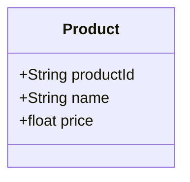
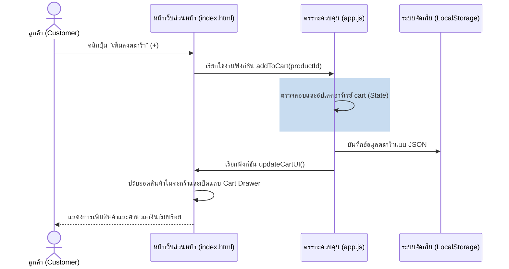
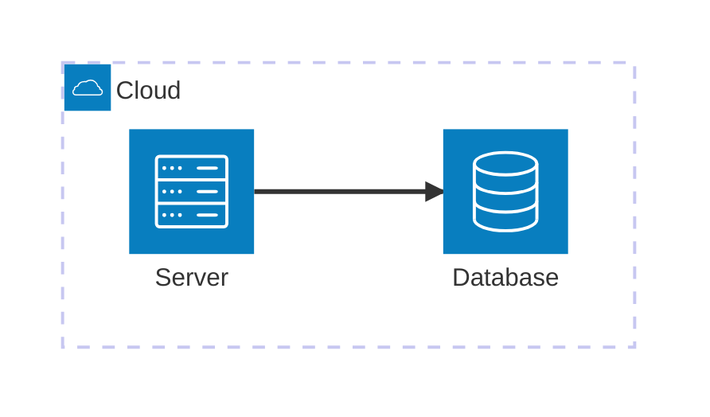

# 🖥️ PC Center – ศูนย์รวมคอมพิวเตอร์และอุปกรณ์ไอที

## 📌 CSI204 Project Hub
ระบบเว็บไซต์ขายคอมพิวเตอร์และอุปกรณ์ไอทีออนไลน์ (E-Commerce Platform)

---

## 📚 สารบัญ (Table of Contents)

1. [ข้อเสนอโครงงาน (Project Proposal)](#1-ข้อเสนอโครงงาน-project-proposal)
2. [Persona Design](#2-persona-design)
3. [Use Case Diagram](#3-use-case-diagram)
4. [Class Diagram](#4-class-diagram)
5. [แผนภาพลำดับการทำงาน (Sequence Diagram)](#5-แผนภาพลำดับการทำงาน-sequence-diagram)
6. [Wireframe](#6-wireframe)
7. [System Architecture](#7-system-architecture)
8. [Tools & Technologies](#8-tools--technologies)
9. [Data Schema (JSON)](#9-data-schema-json)
10. [Progress Report](#10-progress-report)

---

## 1. ข้อเสนอโครงงาน (Project Proposal)

* **ชื่อกลุ่ม:** PC Center
* **ชื่อโครงงาน (ภาษาไทย):** PC Center – ศูนย์รวมคอมพิวเตอร์และอุปกรณ์ไอที
* **ชื่อโครงงาน (ภาษาอังกฤษ):** PC Center – Online PC & IT Equipment Store

### 📝 ความเป็นมาและความสำคัญ (Background & Significance)
ปัจจุบันคอมพิวเตอร์และอุปกรณ์ไอทีมีบทบาทสำคัญต่อการเรียน การทำงาน และความบันเทิง แต่ร้านค้าหลายแห่งยังไม่มีเว็บไซต์ที่ช่วยให้ลูกค้าค้นหาสินค้า เปรียบเทียบราคา และสั่งซื้อได้อย่างสะดวก โครงงานนี้จึงพัฒนาเว็บไซต์สำหรับจำหน่ายคอมพิวเตอร์และอุปกรณ์ไอที พร้อมระบบจัดการสินค้าและคำสั่งซื้อ

### 👥 สมาชิกในกลุ่ม (Group Members)

| ลำดับ | รหัสนักศึกษา | ชื่อ-สกุล | หน้าที่รับผิดชอบ |
| :---: | :---: | :--- | :--- |
| 1 | [รหัส] | [ชื่อ-สกุล] | [เช่น Project Manager] |
| 2 | [รหัส] | [ชื่อ-สกุล] | [เช่น Developer] |
| 3 | [รหัส] | [ชื่อ-สกุล] | [เช่น UI/UX Designer] |
| 4 | [รหัส] | [ชื่อ-สกุล] | [หน้าที่] |
| 5 | [รหัส] | [ชื่อ-สกุล] | [หน้าที่] |

### 🎯 วัตถุประสงค์ (Objectives)
1. พัฒนาเว็บไซต์จำหน่ายคอมพิวเตอร์และอุปกรณ์ไอที
2. ให้ผู้ใช้งานค้นหา เปรียบเทียบ และสั่งซื้อสินค้าได้สะดวก
3. พัฒนาระบบจัดการสินค้าและคำสั่งซื้อสำหรับผู้ดูแลระบบ
4. ประยุกต์ใช้ HTML, CSS และ JavaScript
5. ฝึกใช้ Git และ GitHub ในการพัฒนาและเผยแพร่เว็บไซต์

### 🔍 ขอบเขตของโครงงาน (Project Scope)
* **ผู้ใช้งาน:** สมัครสมาชิก เข้าสู่ระบบ ดูสินค้า ค้นหา ดูรายละเอียด เพิ่มลงตะกร้า สั่งซื้อ (จำลอง) ดูประวัติการสั่งซื้อ
* **ผู้ดูแลระบบ:** เข้าสู่ระบบ เพิ่ม แก้ไข ลบสินค้า จัดการคำสั่งซื้อ และจัดการสต็อกสินค้า

### 📊 ความเป็นไปได้ของโครงงาน (Project Feasibility)
* **ด้านเทคนิค:** ใช้ HTML, CSS, JavaScript, GitHub Pages
* **ด้านงบประมาณ:** ใช้เครื่องมือฟรีทั้งหมด
* **ด้านเวลา:** สามารถพัฒนาให้เสร็จภายในระยะเวลาของรายวิชา

---

## 2. Persona Design

### 🧑 Persona 1: Customer
```
Name: นักศึกษา / ผู้ใช้งานทั่วไป
Age: 18 - 35
Occupation: Student / Freelancer / Office worker

Goals:
- ซื้อคอมพิวเตอร์และอุปกรณ์ไอที
- เปรียบเทียบราคา
- สั่งซื้อออนไลน์สะดวก

Pain Points:
- ร้านทั่วไปเดินทางลำบาก
- ไม่มีข้อมูลสินค้าเพียงพอ

Needs:
- เว็บไซต์ใช้งานง่าย
- มีข้อมูลสินค้าชัดเจน
```

---

### 🧑‍💼 Persona 2: Admin
```
Name: เจ้าของร้าน / ผู้ดูแลระบบ
Age: 25 - 45
Occupation: Business Owner

Goals:
- จัดการสินค้า
- จัดการออเดอร์
- ควบคุมสต็อก

Pain Points:
- จัดการสินค้าหลายรายการยุ่งยาก

Needs:
- ระบบหลังบ้านใช้งานง่าย
```

---

## 3. Use Case Diagram

```mermaid
usecaseDiagram
    %% ตัวอย่างโค้ด Use Case Diagram นำโค้ดของคุณมาวางทับที่นี่
    actor User
    User --> (Login)
    User --> (Browse Products)
```

---

## 4. Class Diagram



---

## 5. แผนภาพลำดับการทำงาน (Sequence Diagram)

ลำดับขั้นตอนการทำงานเมื่อผู้ใช้งานทำการเพิ่มสินค้าคอมพิวเตอร์ลงในตะกร้า:



---

## 6. Wireframe

*(ระบุลิงก์ Figma หรือแทรกรูปภาพ Wireframe ของคุณที่นี่)*

---

## 7. System Architecture



---

## 8. Tools & Technologies

* **Frontend:** HTML5, CSS3, JavaScript (Vanilla)
* **Design:** Figma
* **Version Control:** Git, GitHub
* **Storage:** LocalStorage (Browser)

---

## 9. Data Schema (JSON)

**👤 User**
```json
{
  "user_id": 1,
  "name": "John Doe",
  "email": "john@gmail.com",
  "role": "customer"
}
```

**📦 Product**
```json
{
  "product_id": 1,
  "name": "Gaming Mouse",
  "price": 599,
  "stock": 20,
  "category": "Mouse"
}
```

**🛒 Cart**
```json
{
  "cart_id": 1,
  "user_id": 1,
  "items": []
}
```

**📑 Order**
```json
{
  "order_id": 1,
  "user_id": 1,
  "total_price": 599,
  "status": "pending"
}
```

---

## 10. Progress Report

- [x] จัดทำ Project Proposal
- [x] ออกแบบ Sequence Diagram
- [ ] พัฒนาระบบส่วน Frontend
- [ ] ทบทวนและทดสอบระบบ
```
